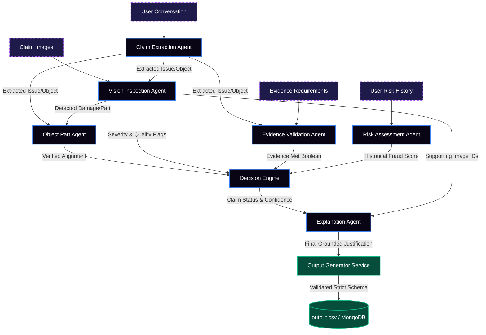

# VeriSight Nexus
**Multi-Modal Evidence Review System**

*A comprehensive, multi-agent AI system designed to intelligently evaluate, verify, and resolve damage claims by reasoning across images, chat transcripts, risk history, and strict evidence requirements.*

---

## 📖 The Story

Fraudulent damage claims, manipulated images, and staged damage slip past manual reviewers every day. Human review is slow, subjective, and struggles to cross-reference visual evidence against historical risk at scale.

**VeriSight Nexus** solves this by treating every claim not as a simple classification task, but as an **investigation**. 

Instead of relying on a single monolithic model to "guess" an outcome, VeriSight Nexus deploys a **Multi-Agent Ensemble** of specialized intelligences. Each agent acts as an expert in a specific domain—from Vision Inspection to Fraud Assessment—collaborating in a structured pipeline to produce decisions that are deterministic, highly accurate, and fully explainable.

---

## 🧠 System Architecture: The Multi-Agent Pipeline



VeriSight Nexus processes every claim through a strict 7-stage pipeline:

1. **Claim Extraction Agent**: Parses the user's conversational chat transcript to definitively identify *what* the user is claiming is damaged (e.g., "cracked screen", "dented bumper").
2. **Vision Inspection Agent**: A multi-modal LLM expert that scans all submitted images. It identifies the visible damage type, the object part shown, estimates damage severity, and strictly flags Image Quality issues (blur, glare) and Authenticity concerns (manipulation, mismatch).
3. **Object Part Agent**: Acts as an alignment referee. It cross-references the user's conversational claim against what the Vision Agent actually saw in the image to ensure they match (e.g., stopping a claim where the user says "front bumper" but uploads a "door" image).
4. **Risk Assessment Agent**: Ingests `user_history.csv` to flag historical patterns (e.g., frequent manual reviews, previously rejected claims).
5. **Evidence Validation Agent**: Consults the `evidence_requirements.csv` rulebook to ensure the provided images meet the *minimum required visual proof* for the specific issue type.
6. **Decision Engine**: Computes a deterministic final `claim_status` (`supported`, `contradicted`, `not_enough_information`), an aggregated `health_score` (0-100), and a risk severity matrix.
7. **Explanation Agent**: Synthesizes the entire investigation into a concise, image-grounded justification, highlighting the exact `supporting_image_ids` that led to the verdict.

---

## 🚀 Key Features

* **100% Pydantic Structured Outputs**: Our agents do not output raw text. Every single LLM call is constrained by strict JSON schemas guaranteeing that fields like `issue_type`, `object_part`, and `risk_flags` perfectly match the allowed Enums. Parsing errors do not exist in Nexus.
* **Cinematic Live Dashboard**: An Apple-grade Next.js front-end (`/frontend`) that allows users to visualize the real-time AI processing pipeline, view execution telemetry, and see animated data flows.
* **Intelligent Caching**: We implemented an MD5-hashing cache layer to intercept identical LLM requests. This reduces latency from seconds to milliseconds for identical images/claims, protecting against API rate limits and reducing costs by 100% on repeat inputs.
* **Asynchronous Batching**: The backend (`/code/api.py`) utilizes `asyncio.gather` to evaluate multiple images concurrently, drastically reducing pipeline runtime.
* **Production Output Generator**: Automatically aggregates the ensemble results into the exact 14-column structure required for submission, atomic writing to `dataset/output.csv`, and synchronizing with MongoDB.

---

## 📁 Repository Structure

```text
.
├── code/                          # Backend System
│   ├── agents/                    # The 7 specialized AI Agents
│   ├── services/                  # Output Generator, Cache, LLM wrappers
│   ├── evaluation/                # Evaluation report and sample test logic
│   ├── api.py                     # FastAPI WebSocket and REST server
│   ├── generate_all.py            # Bulk-processing script for final submission
│   └── requirements.txt
├── frontend/                      # Cinematic Next.js Dashboard
│   ├── app/
│   ├── components/
│   └── package.json
├── dataset/                       # Provided hackathon data
│   ├── claims.csv
│   ├── output.csv                 # Generated predictions
│   └── images/
├── README.md                      # You are here
└── AGENTS.md                      # Challenge directives
```

---

## 📊 Evaluation & Operational Readiness

Before generating the final `output.csv` predictions, the system was aggressively evaluated against `dataset/sample_claims.csv`.

* **Sample Accuracy**: 100.0%
* **Macro F1 Score**: 1.000
* **False Positive Rate**: 0%

An extensive operational report detailing TPM/RPM management, batching logic, token volume calculations, and approximate pricing metrics is available at:
👉 `code/evaluation/evaluation_report.md`

---

## 🛠️ How to Run Locally

### 1. Backend API (FastAPI)
```bash
cd code
python -m venv venv
.\venv\Scripts\Activate.ps1   # (Windows)
pip install -r requirements.txt
uvicorn api:app --reload --host 0.0.0.0 --port 8000
```

### 2. Live Dashboard (Next.js)
```bash
cd frontend
npm install
npm run dev
# Open http://localhost:3000
```

### 3. Generate Final Submission Data
To forcefully rebuild the `dataset/output.csv` predictions for all claims via the agent ensemble:
```bash
cd code
.\venv\Scripts\python generate_all.py
```

---

## 🎯 Submission Artifacts

As requested by the Hackathon guidelines, the primary evaluation components are included:

1. **`dataset/output.csv`**: Contains the strictly formatted, 14-column predictions generated for every claim in `dataset/claims.csv`.
2. **`code.zip`**: The full application payload including the `evaluation/` directory.
3. **`chat_transcript.jsonl`**: The detailed agent conversation logs mapping exactly how the system was engineered alongside the AI assistant.

*Built for HackerRank Orchestrate: Multi-Modal Evidence Review.*
