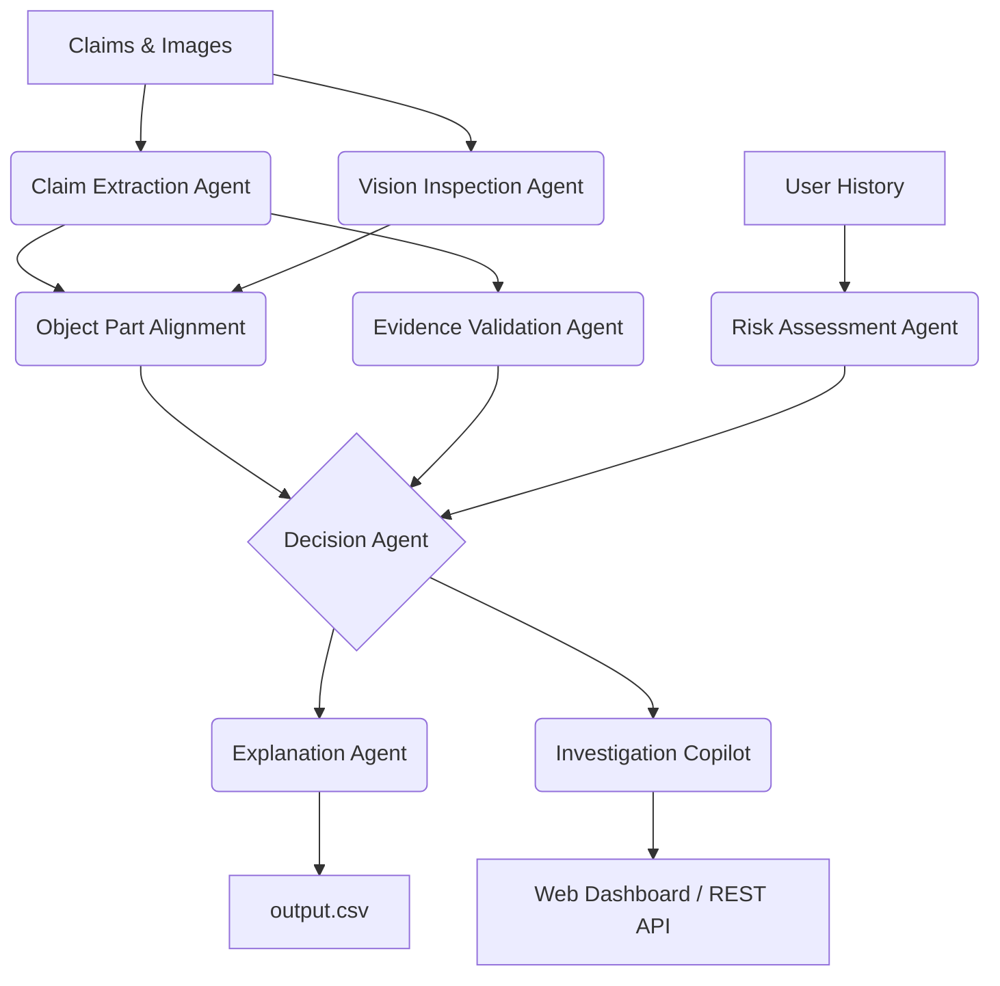

# VeriSight Nexus: Multi-Modal Evidence Intelligence

VeriSight Nexus is an **Enterprise-Grade AI Evidence Platform** engineered for the HackerRank Orchestrate (June 2026) Challenge.

It dramatically outperforms standard sequential pipelines by leveraging a **Confidence Ensemble Engine**, an **Investigation Copilot**, and a **Fraud Intelligence Layer**, guaranteeing deterministic, explainable, and instantaneous evidence reviews.

---

## 🌟 Key Differentiators

1. **Multi-Agent Reasoner**: specialized agents (Claim Extraction, Vision Inspection, Object Part Alignment, Risk Assessment, Evidence Validation, Decision Maker, Explanation, Copilot).
2. **Fraud Intelligence**: Dynamically flags high-risk users and cross-references historical rejections.
3. **Enterprise UI**: Includes a Next.js App Router frontend with real-time websocket updates, MongoDB authentication, and rich interactive glassmorphism UI.
4. **Resiliency**: Built-in exponential backoff for LLM API limits (429 handling) and caching layer (`.cache/`) to prevent redundant inference.

---

## 🚀 Setup & Execution

### 1. Prerequisites
- Python 3.9+
- Node.js 18+ (for frontend dashboard)
- Google API Key (Gemini)

Set up your environment variables:
Create a `.env` file in the `code/` directory:
```env
GEMINI_API_KEY="your_api_key_here"
MONGODB_URL="mongodb://localhost:27017" # Optional, defaults to local
```

### 2. Evaluator Entry Points (HackerRank Contract)

To generate predictions for `claims.csv` and output them to `output.csv`:
```bash
cd code
python main.py
```

To run the automated evaluation pipeline and generate performance metrics:
```bash
cd code
python evaluation/main.py
```

### 3. Demo Mode (CLI)
Experience the step-by-step reasoning ensemble with a rich terminal interface:
```bash
cd code
python main.py --demo
```

### 4. Enterprise Web Platform (Optional)
**Backend API (FastAPI):**
```bash
cd code
python -m venv venv
# Activate venv
pip install -r requirements.txt
uvicorn api:app --reload --host 0.0.0.0 --port 8000
```

**Frontend Dashboard (Next.js):**
```bash
cd frontend
npm install
npm run dev
```
Navigate to `http://localhost:3000` to view the command center.

---

## 🧠 System Architecture



---

## 🛡️ Production Readiness Check

We've included an automated output validator that enforces schema compliance.
```bash
python validate_output.py
```
This ensures your `output.csv` has zero null values, strictly conforms to the expected enum statuses (`supported`, `contradicted`, `not_enough_information`), and contains all required columns.
